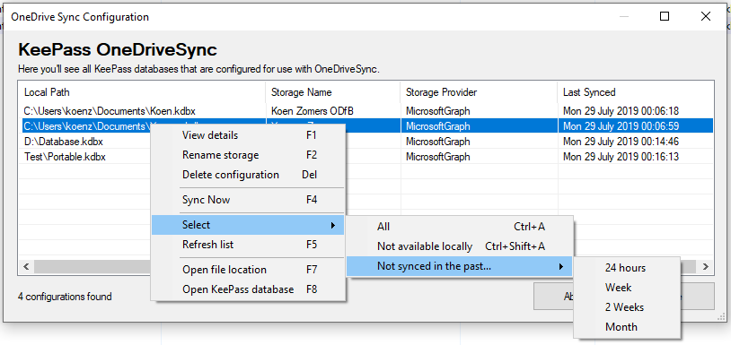
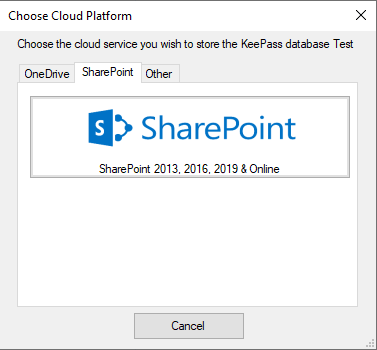
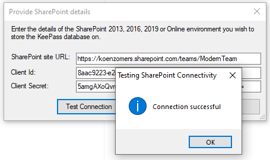
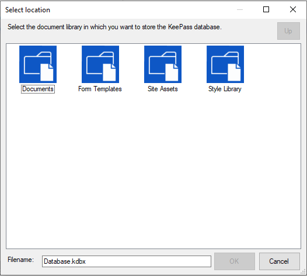

# KeePass OneDrive Sync

## Configuration options

Under Tools -> OneDrive Sync Options you will find all the KeePass databases that are set up for synchronization through the plugin. Note that the local file path is the key of the configuration for the synchronization. This means that if you would move the locally stored KeePass database, you will have to set up the synchronization with OneDrive again.


In this configuration window you can right click on an entry to get a context menu with options for that specific KeePass database.



I.e. you can choose to delete configuration of KeePass databases you no longer want to synchronize (keyboard shortcut DEL). You can also force a synchronization to happen or view the underlying details of a synchronization as to which OneDrive it is being synced to and to which folder.

You can also choose to view more details on the configuration kept for a KeePass database synchronization (keyboard shortcut F1).


A complete listing of the available keyboard and mouse shortcuts on this screen:
 
- F1: Opens the sync details screen. Only works when one KeePass database is selected.
- F2: Allows renaming of the storage name for the KeePass database(s) you have selected
- F4: Starts syncing the selected entries, if those databases are currently open in KeePass
- F5: Refreshes the list with configuration entries
- F7: Open the local file locations of the KeePass database(s) you have selected
- F8: Open the selected KeePass database(s) in KeePass (new feature)
- DEL: Remove the KeePass OneDriveSync configuration entries for the selected KeePass database(s). It will not remove the KeePass database itself, just the KeePass OneDriveSync configuration for it.
- CTRL+A: Select all KeePass databases
- CTRL+SHIFT+A: Select all KeePass databases that no longer exist locally (red colored background)
- CTRL+Click: Select another KeePass database
- SHIFT+Click: Select all KeePass databases between the currently selected one and the one you're clicking on

## HTTP Proxies

If you're using a HTTP proxy to communicate with the internet, configure the HTTP proxy in KeePass under Tools > Options > Advanced tab > Proxy at the bottom right. The KeePassOneDriveSync plugin fully supports the use of HTTP proxies and will automatically take over these proxy settings.


## Offline mode

Starting with version 2.0.0.0 an option has been added under the File menu to temporarily mark the KeeOneDriveSync plugin for offline mode. This means no attempts will be made to synchronize the database after opening or saving it. This setting is purposely not retained after restarting KeePass. It could be useful if your connection isn't ideal for syncing and you have to make a lot of changes. Note that offline mode goes for all KeePass databases you may have open. If you wish to manually sync one even though you're in offline mode, just open the KeePass database, go to Tools -> KeeOneDriveSync Options -> right click on database to sync -> Sync Now.


## SharePoint Online (Team)sites

If you want to store your KeePass database on a SharePoint Online (Team)site, the easiest way to do so is to follow these steps.

### If you already have your KeePass database uploaded to SharePoint Online

1. With your internet browser go to the SharePoint Online site and into the document library where you have stored the KeePass database
2. Right click on the KeePass database and choose Share
3. Choose "Specific people" and check "Allow editing"
4. Enter the e-mail address(es) of the people you want to share it with. If you just want to share it with yourself, enter your own e-mail address, even if you already have rights to the KeePass database. This sharing is required for it to show up under "Shared with me" in the KeePass OneDriveSync plugin.
5. In KeePass use Open -> Open from OneDrive -> Microsoft Graph -> log in with your Office 365 account -> in the file picker choose the "Shared with me" tab -> it should show your KeePass database -> click on it and open it

### If you still only have your KeePass database locally and would like to upload it to SharePoint Online

1. With your internet browser go to the SharePoint Online site and into the document library where you want to store the KeePass database. 
2. Create a folder in which you want to store the KeePass database. Storing it in the root of a document library is not easily possible for now.
3. Right click on the folder you just created and choose Share
4. Choose "Specific people" and check "Allow editing"
5. Enter the e-mail address(es) of the people you want to share it with. If you just want to share it with yourself, enter your own e-mail address, even if you already have rights to the folder. This sharing is required for it to show up under "Shared with me" in the KeePass OneDriveSync plugin.
6. In KeePass open the KeePass database you have locally and would like to upload to the SharePoint Online site
7. Hit CTRL+S to initiate the KeePass OneDriveSync dialog to sync it
8. Choose the Microsoft Graph option and log in with your Office 365 account
9. In the file picker choose the "Shared with me" tab
10. It should show the folder you shared with yourself at step 3, double click on it to go in there
11. Save the database as you wish and it will be uploaded to the SharePoint Online site and stay in sync with that location

## SharePoint 2013, 2016, 2019 and SharePoint Online support

Starting with version 2.0.0.0 it is now also possible to sync your KeePass database with SharePoint. As the Microsoft Graph API support for SharePoint is still very limited and I wanted to support on premises farms as well, I've chosen to implement SharePoint REST API calls with Low Trust oAuth to access SharePoint. This makes it fully asynchronous, support the KeePass proxy configuration and very little data traffic will be used. This also means you will manually have to set up the oAuth token and your SharePoint farm needs to support the Low Trust (ACS) oAuth scenario for SharePoint. You can set up an oAuth token only if you're a site collection administrator of the SharePoint site where you want to store the KeePass database. If you are, then follow these steps to set up the token:

1. Go to -sharepoint site collection URL-/_layouts/appregnew.aspx
2. Click on the Generate button next to both the Client Id and Client Secrets fields
3. Enter anything you'd like in the Title field, i.e. 'KeeOneDriveSync Token'
4. Enter anything you want in the App Domain field. This value is not used but must be filled out. I.e. 'github.com'
5. Enter anything you want in the Redirect URI field. This value is not used but must be filled out. I.e. 'https://github.com'
6. Click on the Create button
7. Make a copy of the Client Id and Client Secret values somewhere, i.e. in notepad
8. Go to -sharepoint site collection URL-/_layouts/appinv.aspx
9. Paste the Client Id from the previous steps in the App Id field and click on Lookup
10. In the Permission Request XML field paste (leave the text exactly as is, do not customize the XML to match your specific site collection):

```XML
  <AppPermissionRequests AllowAppOnlyPolicy="true">
    <AppPermissionRequest Scope="http://sharepoint/content/sitecollection/web/list" Right="Write" />
  </AppPermissionRequests>
```

11. Click on the Create button
12. In the trust dialog, select the document library in which you want to store your KeePass database and consent to the trust dialog
13. Go into KeePass and open the existing database you wish to store in SharePoint or create a new KeePass database
14. Hit CTRL+S or click the Save button to start the KeePassOneDriveSync configuration wizard.
15. Click OK on the "Start syncing with OneDrive" dialog to continue. Make sure that "Yes" is the selected option.
16. On the "Choose Cloud Platform" dialog, go to the second tab called "SharePoint" and click on the banner "SharePoint" 
17. In the "Provide SharePoint details" dialog, enter the Client Id and Client Secret from step 7 above and as the SharePoint Site URL, enter the URL to the site where you want to store the KeePass database, i.e. https://tenant.sharepoint.com/sites/keepass. This should be the same site you used at step 1 above.
18. Click on "Test Connection" to see if all steps above have been performed correctly. It should show "Connection successful". If it doesn't, go over the steps above again and see what you could have missed. If it does, continue with the next step. 
19. Using the location picker that appears, select the location where you want to store the KeePass database and click "OK" 
20. Your KeePass database will now upload to SharePoint and will stay in sync with that location and the version on your device.

Few notes:
- You only need to perform these steps once
- Unlimited users can use this Client Id  / Client Secret token to sync the KeePass database
- The Client Id / Client Secret gives write access to the entire document library you have chosen at step 19, so treat the client id and client secret as credentials and keep them safe.
- Low Trust OAuth tokens expire automatically after 1 year. Instructions on how to [renew the token can be found here](https://docs.microsoft.com/en-us/sharepoint/dev/sp-add-ins/replace-an-expiring-client-secret-in-a-sharepoint-add-in). These steps allow you to extend the validity of the token with at most 3 years. If you find these steps too complex, you can also just repeat the step above to generate a new Client Id / Client Secret which will be valid for a year again.
- If you believe the Client Id / Client Secret have been compromised by someone that shouldn't have access, you can simply revoke the oAuth trust by going to -sharepoint site collection URL-/_layouts/appprincipals.aspx and click on the black X in front of the token you wish to revoke. It will show up using the name you've provided at step 3.

I will also attempt to add support for High Trust oAuth at a later stage as that's more typically being used with on premises SharePoint farms.
